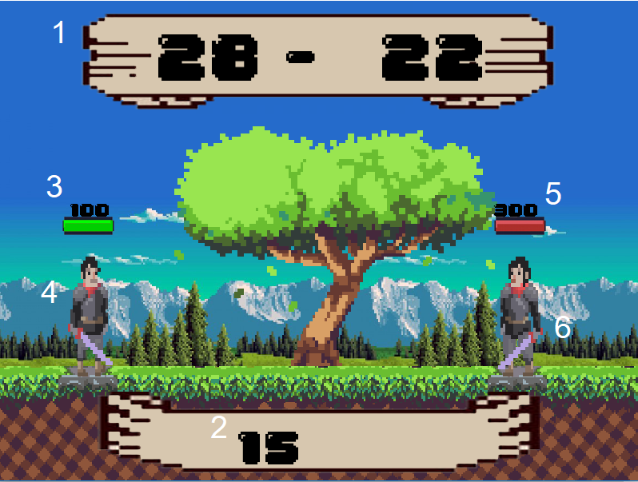

 

# Introduction
 เนื่องในปัจจุบันเด็กส่วนใหญ่ไม่ชอบคณิตศาสตร์ทางกลุ่มจึงเห็นว่าจะนำประโยชน์จากเกมมาประยุกต์ใช้กับวิชาคณิตศาสตร์เพื่อที่จะให้เด็กมีความสนใจในคณิตศาสตร์พร้อมเพลิดเพลินกับเกมไปด้วย เกมนี้จะช่วยฝึกทักษะทางด้านการคำนวนให้เด็กมีกระบวนการคิดทางด้านคณิตศาสตร์ตั้งแต่การ บวก ลบ คูณ และ การหาร  การที่ทางกลุ่มใช้เกมมาเป็นตัวช่วยเพราะว่าเราเล็งเห็นสื่อบันเทิงสมัยนี้ชนิดเกมเป็นที่นิยมในกลุ่มที่หลากหลาย เกม จึงสามารถเข้าถึงบุคคลได้ทุกเพศทุกวัย แถม ยังรู้สึกสนุกไปกับการคำนวนเลขไปพร้อมๆกัน
 
 

# Tools

- [SFML](https://www.sfml-dev.org/download/sfml/2.5.1/) Library ที่ใช้ในการสร้าง

 

# How to install 

1. โหลด zip file จาก [Github](https://github.com/sutha001/Math-Adventure)
2. ทำการแตกไฟล์
3. เข้าไปที่ Debug > ดับเบิ้ลคลิกที่ Math Adventure.exe เพื่อเริ่มเกม 

# How to play

1. บวกหรือลบสมการให้ถูกต้องเพื่อที่จะทำดาเมจ
2. ถ้าตอบถูกจะทำดาเมจ 20 ตอบผิด เลือด -20
3. ชนะเกมเมื่อปราบศัตรูได้สำเร็จ
4. ถ้าเลือดหมดจะแพ้ทันที

interface ต่างๆ ภายในเกม

 

1. โจทย์สมการที่เกมสุ่มมาให้ 
2. คำตอบที่เราพิมพ์ 
3. เลือดของตัวละครเรา 
4. ตัวละครผู้เล่น 
5. เลือดศัตรู 
6. ตัวละครศัตรู 

# Screen Shot 

 

 

 

 

# NOTE!

- ลดฟังก์ชั่นการใช้ยา
- ลดจำนวนศัตรูลง

# Team Members
|Name|Surname|GitHub|Student ID|
|--|------|---------------|---------|
|Pakapat|Vongsattatikhun|[@tungxyz191](https://github.com/tungxyz191)|60070151|
|Sutha|Binkamit|[@sutha001](https://github.com/sutha001)|61070248|
|Salanyapong|Janprik|[@OatHostdm](https://github.com/OatHostdm)|61070347|
|Rachata|Pangkariya|[@61070348](https://github.com/61070348)|60070348| 

# Assistant Teacher
- ผศ. ดร. กิติ์สุชาต พสุภา
- ผศ. ดร. ปานวิทย์ ธุวะนุติ

รายงานนี้เป็นส่วนหนึ่งของวิชา Computer Programming : Information Technology @KMITL

---

